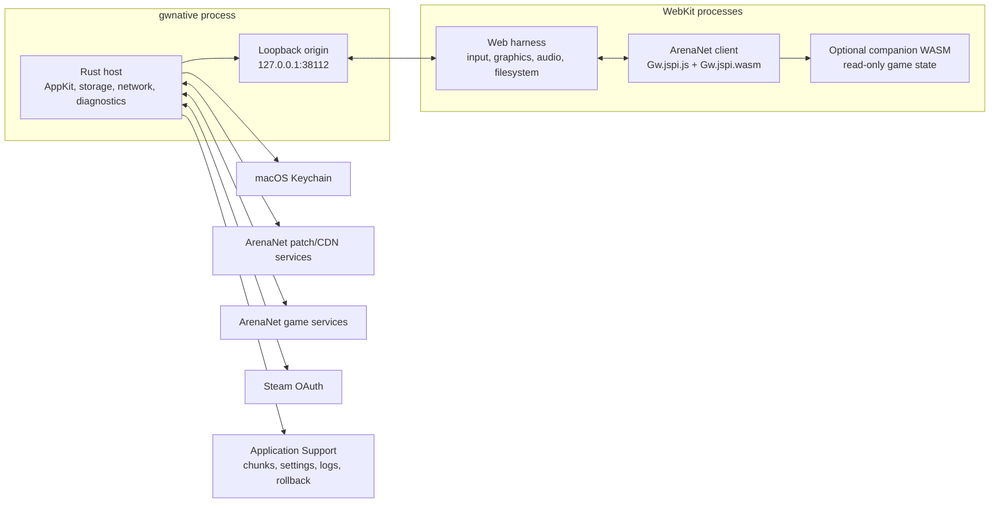

# Architecture

gwnative is a native host around ArenaNet's generated Guild Wars WebAssembly
client. It deliberately keeps generated client code in a browser realm and
implements the operating-system boundary in Rust.

## System boundaries

ArenaNet regenerates `Gw.jspi.js` with every client patch. That glue expects a
browser implementation of JSPI, WebGL, Web Audio, IndexedDB, DOM events, and the
Emscripten runtime. Replacing it with a native WebAssembly runtime would require
reimplementing those contracts and tracking every generated change. WKWebView
is therefore a compatibility boundary, not a general application framework.

Rust owns patching, chunk storage, outbound network policy, socket bridges,
credentials, windowing, diagnostics, updates, and release integration.
JavaScript is limited to the code that must share the client's realm: graphics
and audio import patches, filesystem compatibility, input translation, the
launcher, settings UI, and metrics.

## Boot sequence

`src/main.rs` orders launch phases by dependency:

1. Parse no command, `sync`, `serve`, help, or version before opening anything.
2. Acquire the per-support-directory single-instance lock.
3. Check whether the current code-signing identity can use the Keychain item.
4. Select a writable web root.
5. Load the cached manifest and revalidate it in the background, or fetch a
   current manifest for an explicit sync.
6. Roll back an unproven client, verify installed artifacts, and fetch missing
   or newer artifacts.
7. Open the game-image chunk store, consume a pending clear request, replay the
   boot prefetch list, and start cursor-based readahead.
8. Start diagnostics and load settings.
9. Prepare certified WebAssembly transforms when available.
10. Start the loopback origin and inject its session token, current keyboard
    layout, settings, update capabilities, and module state at document start.
11. Create the WKWebView, window, menu, native event bridges, renderer recovery,
    and application lifecycle delegate.
12. Mark the client generation proven and seal the boot chunk list when the
    page reports its first frame.

The `sync` command exits after artifact installation. The `serve` command stops
after step 10 and prints `<address> <session-token>` on stdout.

## Loopback origin and trust model

The page is served from HTTP loopback instead of a custom WebKit scheme:

- loopback is a trustworthy secure context;
- COOP and COEP make it cross-origin isolated;
- IndexedDB works normally; and
- `performance.now()` retains sub-millisecond resolution, which the per-frame
  telemetry needs.

The listener binds only `127.0.0.1`. Port `38112` is fixed because WebKit keys
IndexedDB by origin, including the port. If the port is unavailable, an
ephemeral fallback keeps the app launchable but temporarily presents an empty
page-data origin.

Loopback is machine-local, not user-private. Host capability routes beginning
with `__` therefore require a random session token. The token is injected into
the page through `WKUserScript`; it is never served over the socket. The window
prints it only when `GWNATIVE_PRINT_TOKEN` is set, and `serve` prints it because
external test clients otherwise have no route through the gate.

Content requests are intentionally not token-gated because the generated client
cannot attach a custom header. Their authority is narrow instead:

- static paths are resolved beneath the configured web root;
- the derived module is mapped to the original module's filename;
- snapshot requests require a bounded byte range;
- HTTP forwarding uses a closed route-to-host table; and
- game sockets permit only ArenaNet/Guild Wars domain suffixes, ports 6112, 80,
  and 443, and public-unicast destination addresses.

This blocks loopback, private networks, link-local services, multicast, IPv4
addresses disguised as IPv6, and unrecognised names.

Every host response carries a content-security policy, COOP/COEP/CORP, and
`nosniff`. The policy allows the Emscripten requirements (`unsafe-eval`,
`wasm-unsafe-eval`, and blob workers) but denies objects, frames, base URL
changes, forms, and off-origin resource loads. A navigation delegate rejects
top-level navigation away from the exact loopback origin.

### Steam authentication boundary

Steam is the only federated provider gwnative advertises to the Reforged
client. The client supplies an explicit `silent` flag when it asks for an auth
token. A silent request can only read a valid token from Keychain; it cannot
open UI. A non-silent request is the player choosing the Steam button and is the
only path that opens the OAuth sheet.

The sheet is a separate WKWebView with a non-persistent website data store and
no injected loopback capability token. Its native delegates:

- allow top-level HTTPS navigation only on Steam- and Valve-owned suffixes;
- refuse embedded credentials, non-default ports, popups, downloads, capture,
  motion, and file-selection surfaces;
- intercept the exact HTTPS Guild Wars redirect before loading it;
- require the attempt's unguessable OAuth `state`; and
- settle cancellation or WebKit termination back to the client.

Concurrent interactive requests join the same attempt. Sign-out detaches every
older waiter before closing the sheet and deleting the Keychain item, so a late
OAuth callback cannot restore a token after clear. The token has its own
Keychain item and one-year maximum local lifetime; it is not stored alongside
ArenaNet email/password credentials or written to logs.

## Client artifacts and generation rollback

The patch manifest describes the official client files and the chunked game
image. gwnative stores manifest validators and can start from the disk copy,
moving revalidation off the window's critical path.

Artifact presence is not treated as integrity:

- each installed client artifact is recorded by length and SHA-256;
- launch checks the record and downloads only unsound artifacts;
- the offered build ID is derived from manifest data before download; and
- a newly installed generation is unproven until `POST /__booted`.

Before replacing a proven set, gwnative saves it. If the new set fails to report
a first frame before the next launch, the prior set is restored and the failed
build ID is refused. Refusals are bounded, a damaged installed copy may retry a
refused build when no alternative exists, and first install never deletes its
only client merely because an unrelated boot failure occurred.

## Game-image storage

The 4.2 GB snapshot is represented by roughly 16,000 content-addressed 256 KiB
chunks under `Application Support/gwnative/chunks`. The snapshot file is
virtual: the loopback server maps a requested byte range to chunk windows,
fetching missing chunks and streaming the response without assembling the full
range in memory.

Core invariants:

- a hash identifies immutable content;
- a fetched chunk is verified before an atomic rename makes it visible;
- cached bytes are hashed on first use in a session;
- a corrupt file is unlinked and fetched again;
- concurrent readers of the same missing hash share one fetch;
- at most 48 network fetches run concurrently;
- speculative boot, readahead, and full-download work shares a 32-permit subset
  so demand reads always have capacity;
- up to 2,048 verified chunk descriptors are held open for cheap `pread`; and
- manifest activation prunes chunks the current image cannot reference.

Quick Start records the chunks touched before first frame and replays that list
on the next launch. A built-in list covers the first launch. Readahead follows
the current read cursor. Full Game walks the entire manifest, while its progress
bar reports cache residency rather than how far the current walk has advanced.

A complete Full Game launch runs a separate integrity pass. It hashes distinct
resident chunks, discards failures, and lets the ordinary download path repair
them. Verification is separate from resume so every interrupted download does
not pay for a full reread.

## WebAssembly compatibility layers

ArenaNet's current module has broken or missing file routines for build
templates. `src/wasm` applies a transform only when the input SHA-256 matches a
certified build:

1. append small forwarding functions;
2. redirect specific call sites without shifting later bytecode;
3. use impossible negative directory descriptors as bridge markers; and
4. handle those markers in `web/template-save.js` against IDBFS.

The transform asserts the exact output hash. Unknown or failed transforms fall
back to the unmodified module, preserving playability at the cost of the
compatibility feature.

When either optional enhancement is enabled, a second certified transform
clones the client's main-loop function, adds a hook slot and manifest, and
dispatches through an optional table entry. `build.rs` compiles
`src/companion-kernel/lib.rs` directly as dependency-free `no_std`
`wasm32-unknown-unknown` code and embeds it in the host.

The companion imports the client's memory, performs bounds-checked read-only
pointer traversal at a coherent point in the game loop, and publishes fixed
state and cursor blocks through a seqlock. The page validates the snapshot again
before rendering it. Installation allocates through the client's own allocator,
instantiates the companion, fills the table slot, and only then enables the
hook.

## WebKit and native integration

WKWebView lacks several Chromium APIs the client assumes:

- keyboard layout comes from Carbon's `UCKeyTranslate`;
- macOS double-clicks can be translated into the client's touch path;
- mouse focus and application focus are pushed from AppKit;
- graphics imports bridge OffscreenCanvas output to the visible canvas;
- the host constructs and monitors the client's AudioContext; and
- filesystem sync is pulled during application termination.

WebKit preferences that cap high-refresh rendering or suppress hidden content
are disabled by guarded feature-key lookup. Until first frame, the harness also
races `requestAnimationFrame` with a 16 ms timer so an occluded boot continues
to drive client work. After first frame the native frame callback is restored;
game animation and audio retain WebKit's normal timing.

The renderer guard reloads once if WebKit terminates the content process. The
window layer validates persisted geometry against current display work areas,
restores mode separately from the normal frame, and reports the active display's
refresh-rate ceiling.

## Diagnostics

Three producers share one JSONL clock:

- a host sampler records physical footprint, resident memory, CPU time, chunk
  statistics, and registered metrics;
- the page posts count, gauge, and peak buckets to `__diag`; and
- console and unhandled-error lines are batched through `__report`.

Records have `session`, `sample`, `page`, or `mark` kinds. Metric names, page
line counts, line lengths, and file rotation are bounded. The problem-report
layer adds environment and settings, selects the tail of the log, and redacts
email-shaped text.

See the [performance guide](performance.md) for measurement semantics.

## Module map

| Area | Primary paths |
| --- | --- |
| Launch and lifecycle | `src/main.rs`, `src/cli.rs`, `src/app.rs`, `src/instance.rs`, `src/relaunch.rs` |
| AppKit and WebKit | `src/window/`, `src/webview.rs`, `src/renderer.rs`, `src/menu/`, `src/commands.rs`, `src/layout.rs` |
| HTTP origin | `src/server/`, `src/http/`, `src/proxy.rs`, `src/ws.rs` |
| Network bridges | `src/net.rs`, `src/sockets.rs`, `src/transport.rs` |
| Patching and generations | `src/patch.rs`, `src/manifest.rs`, `src/generation.rs` |
| Snapshot cache | `src/chunks/`, `src/cache.rs`, `src/disk.rs`, `src/qos.rs` |
| Credentials and settings | `src/keychain.rs`, `src/steam.rs`, `src/settings.rs`, `src/paths.rs` |
| WebAssembly transforms | `src/wasm/`, `src/companion-kernel/lib.rs`, `build.rs` |
| Diagnostics | `src/diagnostics.rs`, `src/report.rs`, `web/diagnostics.js`, `web/memory.js` |
| Web harness | `web/harness.js`, `web/steam.js`, `web/graphics.js`, `web/audio.js`, `web/filesystem.js`, `web/input.js` |
| Player UI | `web/launcher.js`, `web/settings-panel.js`, `web/guide.js`, `web/loading.js` |
| Packaging and release | `packaging/`, `scripts/bundle`, `scripts/release`, `scripts/publish`, `scripts/appcast` |

## Platform risks

- The deployment floor is macOS 15.2, but WebKit behaviour is verified on newer
  releases and can change independently of this binary.
- Hidden-page and high-refresh behaviour relies on guarded WebKit feature keys.
  Missing keys degrade to WebKit defaults and are logged.
- Client transforms are intentionally pinned to exact module hashes. A new
  ArenaNet build can temporarily disable templates and tools without preventing
  launch.
- Development and packaged builds use separate WebKit storage roots.
- The loopback port fallback changes the page origin for that session.
