# Client artifact certification

This is the publishing runbook. The authoritative installation, runtime
fallback, failure-outcome, and audit state model is
[Client compatibility mechanism](client-compatibility.md).

ArenaNet publishes two official WebAssembly runtimes from one client source:
JSPI for engines with JavaScript Promise Integration and Asyncify for older
engines. They share game data, but they do not share control flow or byte
offsets. Asyncify instruments the suspendable call graph and adds functions,
types and globals, so a JSPI transform certificate is never reused as an
Asyncify certificate.

## What ArenaNet publishes

One official patch manifest currently names both complete runtime pairs:

| Runtime | Generated JavaScript | WebAssembly |
| --- | --- | --- |
| JSPI | `Gw.jspi.js` | `Gw.jspi.wasm` |
| Asyncify | `Gw.js` | `Gw.wasm` |

The same manifest also names `version.json` and the chunked `Gw.snapshot`.
gwnative reads one manifest snapshot, downloads and verifies the four runtime
files plus `version.json` in staging, and promotes that five-file set
failure-atomically. The snapshot remains content-addressed chunk storage rather
than a fifth assembled runtime file.

Three internal identities serve different purposes and must not be substituted:

- the **patch generation ID** is derived from manifest sizes and chunk hashes
  for all four runtime files plus `version.json`; it is known before download
  and drives installation rollback;
- the **artifact-family ID** is derived from the assembled SHA-256 of exactly
  the four JavaScript/WebAssembly files; it selects certification and does not
  change for a metadata-only `version.json` update;
- the **runtime-compatibility ID** is a domain-separated SHA-256 of one runtime
  name, Wasm hash, generated-JavaScript hash, transform ABI and selected output
  hash; it keys local fallback and player notices without confusing a glue-only
  change for the same transform or carrying a refusal into a fixed transformer
  or corrected certificate.

The client's reported program/build values are runtime diagnostics only. They
are neither complete file identities nor certification inputs.

Because every manifest chunk is addressed by its digest, a manifest update
during a download cannot silently mix bytes. The later publishing stage fetches
again and requires the same four-file family ID before signing.

## What a certificate can authorize

`certificates/builds.json` is data, not a patch language. Each runtime record
contains:

- exact SHA-256 identities for its official JavaScript and WebAssembly pair;
- the independently expected template-transform output SHA-256;
- five fixed bridge kinds implemented in the application;
- semantic call identities (function, target-call occurrence and total);
- exact hashes of every target and caller function body; and
- when available, an artifact-family proof for shared data, element and
  global-prefix bytes.

It cannot provide WebAssembly instructions, imports, exports, table entries or
native code. The application appends its five compiled-in forwarders and then a
separate structural verifier validates the resulting module with `wasmparser`,
checks the appended types and bodies, and proves that existing code changed only
at the authorized call operands before accepting the pinned output hash.

The read-only companion layout is inherited only when both exact new artifacts
reproduce each other's data, element and shared-global-prefix identities *and*
those identities exactly match the most recent certified layout. The generator
never updates copied offsets merely because JSPI and Asyncify agree with each
other. A proof change keeps `layout` null and `passiveEnhancements` false while
still allowing both independent template transforms to be certified. Template
save never reads game-memory offsets.

## Automatic patch workflow

The normal ArenaNet patch cycle requires neither an operator nor a gwnative
release. `Client certificate` runs once every 24 hours and can also be started
manually without capability checkboxes or publisher build numbers.

```mermaid
flowchart LR
    A["Poll ArenaNet"] --> B["Fetch all 4 official artifacts"]
    B --> C["Derive family and capability gates"]
    C --> D["Verify both exact transform outputs"]
    D --> E{"Feed changed?"}
    E -- "No" --> F["Finish without signing"]
    E -- "Yes" --> G["Fetch all 4 artifacts again"]
    G --> H["Require identical family and candidate SHA-256"]
    H --> I["No-secret closed schema + transition validation"]
    I --> R["Reserve sequence + candidate digest"]
    R --> J["Isolated Ed25519 signer; no checkout"]
    J --> K["Verify signature and exact 2-file scope"]
    K --> L["Open certificate-only draft PR"]
    L --> M["Reviewed merge updates installed apps"]
```



The five stages have deliberately separate authority:

1. The first no-secret macOS job fetches the official JSPI and Asyncify pairs,
   generates the candidate, exercises both transforms, validates the passive
   capability gate and reports whether the feed actually changed.
2. A second no-secret macOS job fetches all four files again. It must reproduce
   both the family ID and the complete candidate-feed SHA-256 before uploading
   data for signing. An ArenaNet update between the two fetches therefore stops
   the run.
3. A no-secret validator checks a closed schema at every nesting level, exact
   capability invariants, family identity, consecutive sequence, and that the
   candidate changes only the one reproduced family while retaining bounded
   history. A separate repository-writer then atomically reserves that sequence
   and candidate digest before the signing key can become available. A later
   digest for the same pending sequence fails closed.
4. A fresh `certificate-publishing` job receives only that validated JSON. It
   derives the pinned public key from the private key, signs, and immediately
   verifies the result. It never checks out repository code; after the key is
   present it runs only fixed runner and OpenSSL commands over frozen data.
5. A no-secret publisher verifies the detached signature again, requires the
   sequence to be exactly the current sequence plus one, stages exactly
   `builds.json` and `builds.json.sig`, proves the one-commit diff contains only
   those regular files, and opens a draft PR from a unique certificate branch.
   The canonical per-sequence reservation ref remains authoritative across
   retries; repository rules must reject deletion and non-fast-forward changes.

A known identical family produces a byte-identical candidate, so the signing
key and repository are untouched. A new family with unchanged reviewed anchors
is published automatically. A changed passive proof publishes template support
with native cursor and target readout disabled. A changed template anchor signs
nothing, opens or updates one transformer-review issue, and leaves players on
ArenaNet's unmodified client.

For local diagnosis, the first two stages can be reproduced without signing:

```sh
scripts/client-certify WEB_ROOT
```

The command writes `certificates/builds.candidate.json` and prints the derived
family ID. Manual signing remains available for incident recovery, but it is
not part of the normal patch path:

```sh
scripts/certificate-sign --publish FEED
```

If an anchor changes, inspect the new module before changing compiled transform
logic or reviewed anchors. An application release is needed only when that
compiled policy or its ABI changes; a compatible artifact family is handled by
the signed feed alone.

## Trust and rollback

The certificate bundled into an application is covered by the app's code
signature. A downloaded or cached replacement must verify against the dedicated
Ed25519 certificate public key compiled into the app. The corresponding private
key exists only in the main-only `certificate-publishing` environment (and an
operator's Keychain); candidate generation, ordinary CI, app releases and the
validator/publisher never receive or use it. CODEOWNERS covers the workflow,
key pin, certificate pair, signing scripts, and release path. Publication then
requires the ordinary protected-branch checks and owner review; automation has
no direct path to `main`.

Feed `sequence` is monotonic. A validly signed lower sequence is ignored, a bad
signature falls back to the bundled feed, and a refresh is written only after
the JSON/signature pair verifies. Refreshing happens in the background and
takes effect on the next launch, so network availability is not part of boot.
The feed retains the 256 most recently certified artifact families, in
certification order, and the derived cache retains only the active artifact and
transform ABI. Frequent ArenaNet patches therefore do not create unbounded
signed metadata or local Wasm storage.

Certification is never a playability gate. An unknown pair is served directly
from ArenaNet with template saving and passive tools disabled. If an exact
certified transform cannot instantiate or fails before first frame, gwnative
remembers only that runtime-compatibility ID and retries the same official module.
Only a subsequent failed attempt of the unmodified client can reject and roll
back the ArenaNet patch generation. The client files and their active manifest
are stashed and restored together.
