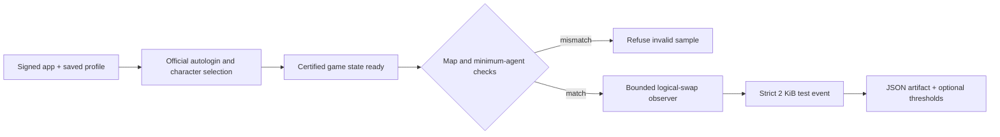
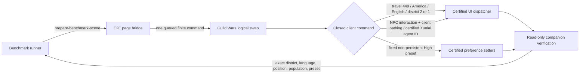

# Performance and measurements

This document separates reproducible observations from architecture contracts.
Numbers describe one environment and are not minimum requirements or promises
for other hardware, WebKit builds, networks, or ArenaNet CDN state.

## Measurement environment

The baseline below was last consolidated on 2026-07-29:

- Apple M3 Pro
- macOS 27.0, build `26A5368g`
- the WKWebView created by gwnative, not Safari

Record the macOS build, hardware, cache state, render scale, display refresh
rate, and measurement window when updating a result.

## WebKit capability probe

| Capability | Observed result |
| --- | --- |
| JSPI functional round trip | Suspend and resume returned `42` |
| WebGL2 on `OffscreenCanvas` | `WebGL2RenderingContext`, GLSL ES 3.00 |
| `transferToImageBitmap` to `bitmaprenderer` | Full round trip |
| IndexedDB | Open and write; 20.6 GB reported quota |
| Secure context | Yes on loopback |
| Cross-origin isolation | Yes; `SharedArrayBuffer` available |
| `WEBGL_compressed_texture_s3tc` | Present |
| WebAssembly memory | WebKit allowed 4 GiB; the client declares a 2 GiB maximum |

At 3840×2160, the measured frame transfer cost was:

| Operation | p50 | p95 |
| --- | ---: | ---: |
| `transferToImageBitmap` | 0.20 ms | 0.30 ms |
| `transferFromImageBitmap` | 0.02 ms | — |

Both the offscreen path and a direct-to-visible control were vsync-bound at
60 fps in that probe, so these are observed costs, not a rendering ceiling.

Known WebKit gaps include `navigator.keyboard.getLayoutMap`, constructible
`Touch`/`TouchEvent` on macOS, `EXT_disjoint_timer_query_webgl2`,
`OVR_multiview2`, and an unmasked GPU renderer string. The architecture guide
describes the implemented input fallbacks.

## Benchmark harness

### Authenticated frame-cadence E2E

`scripts/e2e` can take a bounded sample at the actual `eglSwapBuffers` boundary
after the signed app has authenticated, entered a character, and certified the
stable map, player, and agent population used to identify the scene. Matrix
cells use `--benchmark-only`, so an unavailable optional domain such as guild
detail cannot suppress an otherwise valid cadence sample. A normal full E2E
run still validates every passive domain before sampling. The sampler issues
no rendering or timer-query command, does not enable the expensive draw-call
audit, and never sees Keychain values. Its JSON
contains logical FPS, interval p50/p95/p99/max, drawing-buffer dimensions,
runtime, context-loss evidence, and certified scene metadata.

Before sampling, the runner brings the signed window forward and waits for a
native WebKit animation frame. A locked or sleeping macOS display therefore
fails the benchmark explicitly; the authenticated pregame timer rescue is
never counted as rendering performance.



One controlled cell is:

```sh
scripts/e2e \
  --profile codex-e2e \
  --character "Character Name" \
  --runtime asyncify \
  --frame-isolation on \
  --render-scale 1.5 \
  --fps 120 \
  --benchmark-seconds 20 \
  --expect-map-id 449 \
  --minimum-agents 80 \
  --refresh-hz 120 \
  --benchmark-output /tmp/asyncify-isolation-on.json
```

The full comparison alternates both official runtimes and both presentation
paths, relaunching the signed application for every cell:

```sh
scripts/fps-e2e \
  --profile codex-e2e \
  --character "Character Name" \
  --seconds 20 \
  --expect-map-id 449 \
  --minimum-agents 80 \
  --refresh-hz 120 \
  --output-dir /tmp/gwnative-fps
```

On a fresh automation host with no readable profile Keychain item, set both
`GWNATIVE_E2E_ACCOUNT` and `GWNATIVE_E2E_PASSWORD` on the runner process. The
runner removes them before launching gwnative and transfers one bounded value
through an inherited anonymous pipe. They never appear in the child argv or
environment, loopback protocol, logs, or resulting JSON artifact. An ordinary
gwnative launch has no credential-pipe path.

On a system WebKit without JSPI, use `--runtimes auto asyncify`; the automatic
cell proves the product selected Asyncify, and the forced cell proves the same
artifact explicitly. On a JSPI-capable WebKit, the default matrix exercises
both `jspi` and `asyncify`.

Before sampling, the E2E-only client API applies the fixed High graphics preset,
travels to Kamadan America-English District 2 (District 1 is the bounded
fallback), identifies the two Xunlai agents by their certified numeric agent
fields and their unique close-pair geometry, and invokes the game's own
six-way interaction dispatcher for the stable left-hand anchor. Unlike a raw
world-action packet, this is the client path that approaches an out-of-range
NPC before interacting. The runner may reissue that same bounded command up to
five times because movement can be interrupted by the crowded outpost. The
runner supplies no map, region, language, agent identity, graphics value,
pointer, or coordinate. It receives only the verified final scene and rejects a
player farther than 180 game units from the anchor.

The normal `/__game/v1` API remains read-only. This command path exists only in
a disposable benchmark launch (`GWNATIVE_E2E=1` plus the runner-owned
`GWNATIVE_E2E_BENCHMARK_API=1`), exposes three finite commands, and is appended
only to that launch's derived Wasm. Ordinary UI and login E2E runs therefore do
not depend on paired benchmark certification:



The target locator first proves the compact JSPI functions from their exact
signatures, bounds, storage arrays, and UI notifications. Asyncify is then
accepted only when the paired artifact retains those source-level function
indices, types, dispatcher/messages, storage addresses, bounds, and generated
state guards. No ArenaNet build number, function number, body offset, or memory
address is embedded in the runner. If any proof changes, benchmark preparation
fails closed; the ordinary player client and read-only API are unaffected.

The sample also requires two focused native frames containing the certified
Guild Wars gameplay UI. A suspended, locked, hidden, or non-presenting WebKit
view therefore cannot produce a plausible-looking FPS result.

WebGL GPU timer queries are intentionally not inserted into the live game
context. Every artifact records `gpuTiming: not-sampled`; correlate it with an
external GPU/process trace when distinguishing shader load from CPU submission.
Benchmark-only launches retain a transparent animation-frame wrapper and record
`callbackToSwapMs`: wall time from WebKit entering the client callback until
Guild Wars submits its logical frame. This separates JS/Wasm/WebGL CPU
submission from time waiting for the next WebKit presentation callback without
enabling the expensive per-draw audit. The logical-swap cadence itself detects
a client frame cap, runtime regression, isolation regression, context loss, or
missed frame budget.

### Launch and resource benchmark

`scripts/benchmark` compares this project with a configurable Electron reference
checkout.

Prerequisites:

```sh
export GWNATIVE_REFERENCE_ROOT=/path/to/reference-checkout
```

Build `target/release/gwnative`, run `pnpm install` and `pnpm build` in
the reference checkout, then:

```sh
scripts/benchmark
scripts/benchmark --warm
scripts/benchmark --seconds 180
scripts/benchmark --only gwnative
scripts/benchmark --json readings.json
```

The blank route creates disposable profiles; it never deletes the real ones.
gwnative receives a temporary `HOME`. Chromium ignores `HOME` for its profile,
so the reference build receives a temporary `--user-data-dir`. Both profiles
are seeded with `dataStrategy: "quick"` because the first-run question appears
before either client renders.

The warm route uses the installed profiles and their single-instance locks. It
is the repeated launch and removes CDN variance, but it is not an isolated
profile. The harness reads the profiles and should not change cache size.

### What is compared

External sampling measures:

- wall-clock milestones;
- peak and final resident memory across attributed processes;
- physical footprint across attributed processes;
- CPU seconds across attributed processes;
- process count; and
- bytes written to the disposable profile.

Each application's own first-frame timing is also reported. Internal stage
timelines are not directly comparable because the applications instrument
different stages.

WebKit services are launchd children rather than children of the host. The
harness attributes newly appearing services and excludes candidates that remain
after the run. Treat process-attribution anomalies as invalid samples, not data
to average.

Physical footprint is the primary memory comparison because it approximates
the process's physical cost. RSS includes shared clean pages and can invert a
comparison. A summed high-water mark is a ceiling: individual process peaks may
not have occurred at the same instant.

### Recorded blank-install sample

Four alternating rounds on the same machine and within the same hour:

| Metric | gwnative | Reference |
| --- | ---: | ---: |
| First frame, best · median · worst | 8.5 · 9.1 · 15.4 s | 10.7 · 11.4 · 14.9 s |
| CPU seconds, whole tree, 60 s | 27–39 | 15–33 |
| Footprint peak, summed tree | 2107–2112 MiB | 1316–1412 MiB |
| Full 4.2 GB download | 87–90 s | 90–346 s |

The CDN path measured roughly 47–48 MiB/s during these runs. Both clients
showed fast and slow launch modes. CPU cannot be normalised because gwnative
records its frame count and the comparison build does not; a lower CPU number
can mean cheaper frames or fewer frames.

The blank-install footprint is dominated by WebKit activity during the image
transfer. It is not the steady-state game cost.

### Recorded warm-launch sample

Four alternating rounds, with three clean process-attribution samples for the
tree-wide rows:

| Metric | gwnative | Reference |
| --- | ---: | ---: |
| Page load to first frame, min · median · max | 745 · 821 · 898 ms | 1118 · 1260 · 1366 ms |
| Wall clock to first frame | 1358 · 1496 · 1735 ms | 1715 · 1831 · 2124 ms |
| Footprint peak, summed tree | 767 · 773 · 783 MiB | 1025 · 1043 · 1057 MiB |
| Peak RSS, summed tree | 571 · 572 · 592 MiB | 847 · 848 · 855 MiB |
| CPU seconds, whole tree, 60 s | 18.5 · 19.2 · 19.8 | 10.1 · 22.0 · 26.4 |

The repeated-launch result is the more stable product comparison. It excludes
the one-time transfer and uses data already on disk.

## Measured design decisions

### Fixed loopback origin

A custom `WKURLSchemeHandler` produced a secure context and IndexedDB, but
WebKit clamped `performance.now()` to 1 ms. Loopback measured roughly 0.02 ms
resolution. A fixed port also preserves the IndexedDB origin across launches.

### Connection-per-thread server

The original close-after-response server created hundreds of short-lived
threads during boot. HTTP/1.1 keep-alive removed that churn. WebKit bounds
persistent connections per origin, and the game WebSocket remains long-lived,
so a worker pool would replace a small bounded set of long-lived connection
threads with an equivalent number of workers plus a queue.

Revisit this decision if the protocol, connection lifetime, or browser
connection cap changes; do not generalise it to an internet-facing server.

### Open chunk descriptors

Real-cache microbenchmark, 2,000 chunks, 20 iterations, 32 KiB windows:

| Path | Time |
| --- | ---: |
| Open + `fstat` + `pread` + close | 23.56 µs/op |
| One file per chunk, descriptor held open | 2.82 µs/op |
| One sparse file, descriptor held open | 2.39 µs/op |

Holding the descriptor provided most of the gain. The store therefore keeps up
to 2,048 immutable chunk files open. A single sparse snapshot was rejected
because scattered APFS writes materialised the 4.2 GB file in testing, defeating
on-demand storage.

### Chunk durability

On the measured APFS volume, writing 256 KiB chunks cost:

| Durability action | Time per chunk |
| --- | ---: |
| `F_FULLFSYNC` plus directory sync | 6.74 ms |
| POSIX `fsync` | 0.41 ms |
| No flush | 0.36 ms |

Rust's standard sync methods use the stronger macOS barrier. The cache now calls
POSIX `fsync` and leaves the rename unflushed. Chunks are immutable,
content-addressed, re-hashed on first session use, and re-downloadable, so a
power-loss casualty costs one chunk fetch rather than permanent user data.

### Fetch concurrency and QoS

The store allows 48 HTTP/2 chunk fetches, while speculative work can consume at
most 32. Demand reads retain capacity. Before first frame, fetching is
user-initiated work because the player is waiting for it; after first frame,
background filling moves to Utility QoS.

### Hidden and occluded windows

Current WebKit can stop animation frames, throttle timers, and suppress the web
content process when hidden. That stalled first-install boot work in testing.
gwnative disables the five relevant WebKit feature keys when they are exposed
and races each pre-first-frame animation request with a 16 ms timer.

The timer rescue ends at first frame. A running game then uses native
`requestAnimationFrame` timing so animation and audio are not driven from a
substitute clock. If WebKit removes a feature key, the host logs it and falls
back to that WebKit version's default.

### Render scale

At the login screen, 30 one-second samples across the host and WebKit services:

| Render scale | CPU | RSS |
| --- | ---: | ---: |
| `1×` | 24.2% | 559.9 MiB |
| `2×` | 26.0% | 608.5 MiB |

The 48.6 MiB memory difference is consistent with the larger drawing buffer and
GPU allocation. The CPU gap depends on scene complexity. `2×` remains the
Retina-native default; the setting exposes the trade-off.

#### Crowded Kamadan control

A live control on 2026-08-01 used the M3 Pro above on macOS 27.0 build
`26A5388g`, a 120 Hz built-in display, the same 1280×714 window, Ultra game
graphics, 2× render scale (a 2560×1364 drawing buffer), Loume Loves Ecto, and
America — English — District 2. The character and login screens reached 120
FPS, proving that the host and WKWebView have no 80 FPS presentation ceiling.

| Presentation path | Logical frames | Mean interval | Mean cadence | GPU helper CPU | WebContent CPU |
| --- | ---: | ---: | ---: | ---: | ---: |
| Complete-frame isolation | 1,166 | 16.44 ms | 60.8 Hz | about 97% | about 66% |
| ArenaNet direct framebuffer | 1,256 | 16.09 ms | 62.1 Hz | about 91% | about 61% |

The two 20-second windows used the same character, district, window and
settings; a district transfer did not preserve the exact camera heading, so
this is a product control rather than a shader microbenchmark. The direct run
was only about 1.3 logical frames per second faster and did not approach 120.
The limiting workload is the crowded Ultra scene at the Retina-sized drawing
buffer; the observed load sits primarily in WebKit's GPU and WebContent
processes, not JSPI, Asyncify, or a gwnative frame limiter. Lower render scale
is the available quality/performance trade-off; disabling complete-frame
isolation would restore the partial-frame flash without solving this workload.

## Updating measurements

1. Use alternating runs, not one application's morning against another's
   afternoon.
2. Record every run and report min, median, and max when the distribution is
   multimodal.
3. Keep cache state and render scale comparable.
4. Measure the whole application tree, including WebKit or Electron services.
5. Exclude samples with demonstrably wrong process attribution and say why.
6. Preserve raw JSON with `--json`.
7. Update the date and environment at the top of this document.

Do not promote a single run to a project claim.
