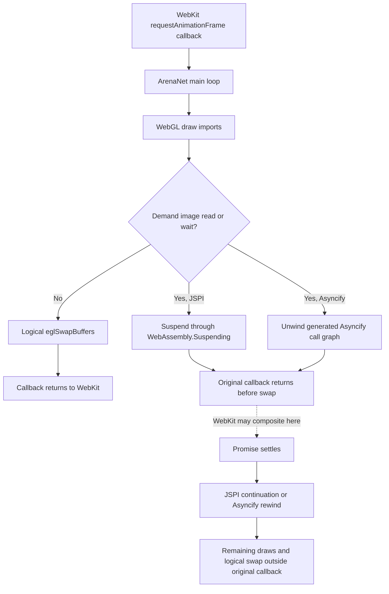
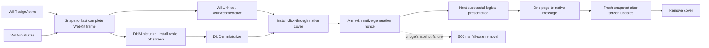

# Rendering diagnostics

This document separates three symptoms that can look alike to a player but
cross different boundaries: a flash when the application becomes active, a
missed or slow frame, and a frame interrupted by a game-data suspension. The
last one is the only mechanism here that can differ in implementation between
JSPI and Asyncify.

## What a submitted frame means

ArenaNet drives `EmscriptenExeThreadMainLoop` through
`requestAnimationFrame`. Its generated `eglSwapBuffers` import validates the
EGL/WebGL state and returns success, but does not flush or present. WebKit owns
the actual compositor boundary. A `gw.frames` sample therefore means “the game
reached its logical swap,” not “the window server displayed a new image.”

This follows WebGL's presentation contract, not an Emscripten convention. The
[WebGL specification](https://registry.khronos.org/webgl/specs/latest/1.0/)
says a draw makes the buffer eligible for the next page compositing operation,
that the implementation flushes immediately before compositing, and that the
default buffer is cleared after presentation. It does not make
`eglSwapBuffers` a browser presentation primitive.

The [HTML rendering algorithm](https://html.spec.whatwg.org/multipage/webappapis.html#update-the-rendering)
runs animation-frame callbacks inside the rendering task and updates the
document's rendering/UI later in that same task. The WebGL rule above makes any
default-framebuffer draw eligible at that later step. When an image Promise is
still unresolved as the animation callback returns, its I/O completion and
continuation cannot retroactively finish the callback before that rendering
step. WebKit can choose to coalesce an update, but the paired native snapshot
test below proves that both target versions do composite the yielded partial
buffer under this condition.

Both official runtimes use the same JavaScript main-loop and WebGL paths. They
differ only when a suspending import is reached:

- JSPI wraps the import with `WebAssembly.Suspending` and the main-loop table
  function with `WebAssembly.promising`.
- Asyncify unwinds the generated call graph, waits, then rewinds it.

In either case, an image read or wait in the middle of drawing can return
control to WebKit before the logical swap, then resume outside the original
animation-frame callback. That is a shared tearing mechanism, not an
Asyncify-only one; whether a particular merchant interaction holds that
boundary open long enough to become visible remains a live-scene question.



The generated glue and Wasm control flow prove where suspension and resumption
can occur. A controlled native snapshot test described below proves the dotted
compositor edge for a yielded partial default framebuffer on both target
WebKits. It does not by itself prove that every short natural wait crosses a
page-compositing opportunity.

Making the JavaScript runner `async` would not close that edge. The official
JSPI glue correctly turns the table entry into a `WebAssembly.promising`
function, but `MainLoop.runIter()` ignores the returned Promise. More
fundamentally, browsers do not wait for a Promise returned by an animation-frame
callback before regaining control: its first `await` still ends the synchronous
event turn. Asyncify reaches the same boundary by unwinding. Blocking the main
thread would also prevent the fetch or timer that must settle the wait, so the
only viable containment is to keep partial draws away from the browser's
default framebuffer.

## Audit signals

Normal builds retain only low-cost evidence: snapshot read count, bytes,
latency and failures; WebGL context loss/restoration; and activation-to-first-
swap timing. Detailed correlation is opt-in because wrapping every framebuffer
write import (draw, clear, or blit) can itself affect a frame.

Set `GWNATIVE_FRAME_AUDIT=1` before launch to add animation callback and draw
boundaries. The audit distinguishes:

| Signal | Meaning |
| --- | --- |
| `readsStartedAfterDraw` | A background or suspending demand read began after this callback drew; correlation only |
| `suspendingReads` | The generated synchronous image-read import suspended |
| `suspendingWaits` | The generated image-wait import suspended, including an already-complete read's mandatory microtask yield |
| `drawCalls` / `clearCalls` | Framebuffer-write attempts seen by the diagnostic wrapper; clears are counted separately but also remain in the historical `drawCalls` total |
| `suspensionsStartedAfterDraw` | A proven suspending import began after at least one framebuffer write and before logical swap; the metric keeps its original name |
| `framesInterruptedAfterDraw` | A logical frame returned control to WebKit after a draw or clear, while a suspension remained pending and before logical swap |
| `drawsOutsideAnimationFrame` / `swapsOutsideAnimationFrame` | Work resumed after the original animation callback had returned |
| `callbacksStartedDuringSuspension` | A later browser callback began while an earlier logical frame was suspended; the wrapper also sees gwnative's passive observer, so this is deliberately weak evidence |
| `callbacksDoingWorkDuringSuspension` | Such a later callback reached a draw, swap, or suspending game import; this is evidence of overlapping renderer work |
| `externalCallbacksDuringSuspension` | A WebSocket open/message/close callback entered the game while an earlier logical frame remained suspended; this can expose state interleaving even if the callback does not draw |
| `outsideWorkDuringSuspension` | A socket, timer, or other non-animation callback reached a framebuffer write, swap, or nested suspension while a logical frame remained suspended |
| `resumedFrame` | The browser callback has ended, but its logical frame is continuing outside that callback after a wait settled |
| `contextLost` / `contextRestored` | WebKit discarded and recreated the WebGL context |
| `activation.lastFrameAgeMs` | Age of the last logical swap when the page receives the host's `DidBecomeActive` command |
| `activation.lastToFirstSwapMs` | Delay from receipt of that command to the next successful logical swap; a lower bound on the already-visible native interval |

`framesInterruptedAfterDraw` together with a later outside-callback draw/swap
is the suspension signature. A nearby read alone is not. Likewise, a browser
callback merely starting while a frame is suspended does not prove renderer
re-entry; `callbacksDoingWorkDuringSuspension` is the stronger signal.

Rare signatures are also emitted automatically. The rolling diagnostics gain
`gw.frame.suspension-after-draw.{read,wait}`,
`gw.frame.interrupted-after-draw`, `gw.frame.swap.outside-animation`, and the
two callback-overlap counters; the first 20 interrupted logical frames also
write a `[frame-audit-event]` line with the runtime, elapsed time, draw count,
whether the original browser callback had ended, pending suspension kind,
suspension stack, and non-sensitive snapshot offset/read ID. A
player does not have to land a manual mark inside a one-frame symptom for that
evidence to survive.

Press **⌘⇧M while the symptom is visible**. The resulting `[frame-audit]` page
line is a self-contained snapshot and accompanies the ordinary high-frequency
diagnostic mark. It includes the last eight interruption/resolution events, so
the useful stack survives even when the first 20 automatic event lines were
already consumed earlier in the session. Run the same interaction at least
once with each runtime:

```sh
GWNATIVE_FRAME_AUDIT=1 GWNATIVE_CLIENT_RUNTIME=jspi cargo run
GWNATIVE_FRAME_AUDIT=1 GWNATIVE_CLIENT_RUNTIME=asyncify cargo run
```

For a refresh-rate control, `GWNATIVE_PREFER_60_FPS=1` leaves WebKit's
near-60-FPS preference at its default instead of explicitly disabling it to
opt into the display's higher cadence. This is a comparison switch, not a
proposed user setting.

For an activation/backing-store control,
`GWNATIVE_PRESERVE_DRAWING_BUFFER=1` asks WebGL to retain the last presented
pixels. If that removes a hidden-to-visible flash without changing activation
timing, the retained surface—not JSPI or Asyncify—is the differentiator. This
is also a comparison switch: preserving a Retina-sized surface has memory and
compositor costs and is not suitable as a default without measurement.

Preservation did not remove the flash. The native window and WKWebView
under-page surfaces now always use the same
black as the document. That removes a system-coloured fallback but cannot hide
WebKit handing the compositor an empty or stale WebGL layer. The retained-frame
cover closes that remaining interval. It takes a WKWebView snapshot while the
application resigns active or the game window begins minimizing. An inactive
window remains live and uncovered; a minimized window receives the cover only
after it is off screen so the image is already present for a Dock restore.
`WillUnhide`, `WillBecomeActive`, and `DidDeminiaturize` converge on the same
click-through cover. Once visible, the page posts the native generation nonce
after its next successful logical swap. The host rejects stale nonces, requests
a second snapshot with `afterScreenUpdates:true`, and removes the cover only
when that request completes. A 500 ms fail-safe prevents a failed page bridge
or WebKit snapshot from leaving a frozen image over a visible game.



## Reproduction matrix

Use the exact same scene and interaction in every cell. Record a mark during
the symptom, not after it.

| Platform | Runtime | Refresh comparison | Required interaction |
| --- | --- | --- | --- |
| macOS 27 | JSPI | native and near-60 | activate window; open merchant |
| macOS 27 | forced Asyncify | native and near-60 | activate window; open merchant |
| macOS 26 | Asyncify | native and near-60 if available | activate window; open merchant |

Interpretation is fail-closed:

- Context-loss counts identify a WebGL/WebKit recovery problem.
- The full suspension signature in both runtimes identifies a shared generated
  main-loop/data-read boundary.
- The signature only in Asyncify identifies an Asyncify unwind/rewind problem.
- No context loss and no suspension signature during a focus flash points to
  AppKit/WKWebView activation or backing-store handoff rather than Wasm.
- A logical frame cadence change without a symptom change rules refresh-rate
  selection out as the root cause.

## Current baseline

The macOS 27 activation test covered JSPI and forced Asyncify at the display's
native 120 Hz cadence and with WebKit's near-60-FPS preference. All four runs
kept a healthy WebGL2 context and recorded no active read, suspension, or
interrupted-frame signature. Native cadence averaged about 8.34 ms per logical
swap; the comparison averaged about 16.69 ms. The first logical swap after
activation took roughly 4–22 ms at native cadence and 24–26 ms in the near-60
comparison.

That evidence classifies the small activation flash as runtime-independent and
does not support either Asyncify or high-refresh rendering as its cause. It
also showed a healthy `alpha: false`, `preserveDrawingBuffer: false` context and,
in one activation, a last logical frame more than four seconds old. The
remaining explanation consistent with those measurements is the activation
handoff: animation frames pause while the application is inactive, AppKit makes
the WKWebView visible, and its WebGL surface has not received its first new
frame yet. The macOS 26 Asyncify runner reproduced the stronger Dock
case by hiding the application for 18.37 seconds. Animation frames stopped, the
WebGL context remained healthy, and the first new logical swap followed
activation by 23.22 ms. No after-draw suspension or outside-callback
continuation appeared. That rules the Wasm runtime out of this focus flash. A
preserved-buffer comparison kept the flash and measured 27.40 ms from the
page's receipt of the `DidBecomeActive` command to the first new swap. Because
AppKit can expose the window before that command is evaluated, 27.40 ms is a
lower bound rather than the full visible interval. Setting both native
under-page surfaces to black also left a small flash. The remaining interval is
therefore the WKWebView/WebGL surface handoff, not the page or window background
colour.

Boot traces now prove that the mechanism in the diagram occurs in both official
artifacts. The final observer attaches no Promise reaction at all: it returns
the exact Promise obtained from `Module.imageReads.get()` and observes the
generated glue's existing `Module.imageReads.delete()` immediately before the
continuation. Both JSPI and forced Asyncify naturally suspended on image read
213 (offset 168461312, 476 bytes) after 59 draws. In both cases the original
browser callback had ended before the wait, the logical frame continued outside
that callback, and it reached the same wrapper and Wasm stack:
`537 -> 550 -> 709 -> 726 -> 769 -> 2185 -> 2197 -> 3007 -> 2797 -> 2811`.
The natural wait lasted about 0.5 ms in each runtime.

The generated image-wait import also executes `await Map#get(id)` after a read
has already been deleted. `await undefined` still yields for a microtask and
suspends both JSPI and Asyncify. The audit therefore records every invocation:
pending Promises end at the generated Map deletion, while an already-complete
wait ends on a separately scheduled diagnostic microtask. Neither path replaces
the value or inserts a reaction into ArenaNet's Promise chain.

Read IDs, offsets, byte counts, frame numbers and draw counts describe one
execution, not an artifact ABI. For example, the fresh macOS 26 run reached the
same wrapper-537 stack at startup with read 213 at offset 168461824 for 472
bytes, after 56 draws. Certification and future comparisons must match the
control-flow signature, not hard-code those incidental values.

A separate controlled cache-miss test prolonged read 210 to hundreds of
milliseconds. Later browser callbacks began while the frame was suspended (18
for JSPI and 11 for Asyncify), but none reached an instrumented draw, swap, or
suspending game import. They may have been the independent passive observer or
stale/no-op game scheduling; either way, they are not evidence of re-entrant
rendering. The generated scheduler explains why the counts need interpretation:
Asyncify calls `MainLoop.pause()` before starting unwind and resumes it before
rewind, whereas JSPI's `MainLoop.runIter()` ignores the promising export's
returned Promise and schedules the next animation callback. The observed JSPI
callbacks nevertheless performed no renderer work while the earlier stack was
suspended. The audit retains the stronger work/callback counters in case a
different live scene does re-enter. No production delay or cache modification
is part of the audit.

Static parsing agrees on the shared call structure. Both artifacts export
`EmscriptenExeThreadMainLoop` as function 446. Their conservative typed-table
path to the image-wait wrappers is the same
`446 -> 883 -> 702 -> 551 -> 536/537`; functions 536 and 537 occupy table slots
42 and 49 and call function import 6, `EmscriptenExeFileImageWait`. Both modules
initialize the same 4,682 function-table members. “Conservative” matters:
indirect calls admit every same-typed member of that actual table, so this path
proves reachability rather than the live target. The live draw/wait/return
sequence is the evidence that the path is actually exercised; the matched live
stack above identifies wrapper 537 in both artifacts.

A second graph containing only statically encoded `call` instructions finds no
path from the main-loop, timer, image-completion, or socket exports to any image
wait, clear, draw, or swap import in either artifact. That is expected for this
client's table-dispatched callbacks, but it is an important limit on the static
result: the typed-table graph cannot prove that an arbitrary timer or socket
callback executes renderer work. The audit's live callback-boundary and
framebuffer-write events are required for that stronger conclusion.

A whole-module topology comparison provides a separate equivalence check. The
JSPI module has 17,822 functions and 218 types; Asyncify has 17,874 and 230.
Across all 17,822 common function indices, however, every resolved function
signature, every direct-call target set, and every indirect-call signature set
is identical, and the initialized function-table membership is identical.
Asyncify's 52 appended functions are its four state exports plus generated
`dynCall_*` entry points. Its transformed bodies still add unwind/rewind state
work, so this does not claim byte equivalence; it shows that the original
client call topology and suspension/render targets were not replaced by a
different Asyncify-only path.

The import inventory is exhaustive for these artifacts, not a search limited
to a suspected name. Each module has 219 function imports and exactly three
whose Wasm call can suspend: `EmscriptenExeFileImageReadSync` (direct callers
530/531), `EmscriptenExeFileImageWait` (536/537), and
`EmscriptenGcPlatformGetPatchMode` (10437). There are no imported
`invoke_*` wrappers. The patch-mode import runs while selecting preload versus
on-demand snapshot startup, before the renderer reaches the merchant scene;
the image read and image wait are therefore the only suspending-import
candidates during rendering. WebSocket and `XMLHttpRequest` callbacks are
ordinary independent JavaScript callbacks rather than Wasm-stack suspension
points. As with the table path, these indices document the current pair of
official artifacts and are evidence, not a future-build contract.

Those events happened during startup, not during the reported merchant
interaction, so they prove a shared mechanism rather than assigning that report
a cause. They also disprove “the fallback tears because it is Asyncify” as a
general explanation: JSPI returned control to the browser at the same unsafe
render boundary. Only a matched live merchant interaction can establish whether
that particular report crosses it.

Emscripten's supported solution is an explicit swap backed by an offscreen
framebuffer. Its
[WebGL API documentation](https://emscripten.org/docs/api_reference/html5.h.html)
states that `-sOFFSCREEN_FRAMEBUFFER` plus `renderViaOffscreenBackBuffer` keeps
content from being presented when an intermediate event callback returns and
presents only at `emscripten_webgl_commit_frame()`. ArenaNet's published glue
contains neither that runtime nor a commit-frame import, so gwnative cannot
enable the flag after compilation. A host-side equivalent would have to
virtualize framebuffer zero and blit only at the certified logical
`eglSwapBuffers` boundary; that is a renderer change needing its own performance
and compatibility work, not a safe toggle.

The current upstream implementation is a useful specification for such a host
shim. Emscripten's
[`libwebgl.js`](https://github.com/emscripten-core/emscripten/blob/main/src/lib/libwebgl.js)
creates a private framebuffer, redirects logical framebuffer zero to it, and
blits its colour attachment to the real default framebuffer only at commit.
The published ArenaNet glue exposes the Emscripten context record through
`canvas.GLctxObject`, but was linked without that conditional code. A
build-independent gwnative implementation would therefore have to reproduce
the following invariants rather than patch a Wasm function index:

1. Enable only on a supported WebGL2 context and otherwise keep the exact
   official direct-rendering path.
2. Allocate colour, depth and stencil attachments matching the context ArenaNet
   actually obtained; the current game requests an opaque colour buffer plus
   stencil, so an RGBA target or upstream's depth-only fallback would change
   observable GL semantics.
3. Redirect every logical bind of framebuffer zero, while preserving ArenaNet's
   own nonzero framebuffer bindings and query results.
4. Resize atomically with the drawing buffer and recreate all private resources
   after context restoration.
5. At successful `eglSwapBuffers`, disable scissoring temporarily, blit colour
   to the real default framebuffer, and restore every binding/state value the
   game owns.
6. Validate framebuffer completeness, pixel output, resize/full-screen, context
   loss, and frame time on both official runtimes before enabling it by default.

Complete-frame presentation now provides that design by default.
It patches only the browser import surface: logical framebuffer-zero binds are
redirected to a private colour plus matching depth/stencil target, and a
successful logical `eglSwapBuffers` blits colour to the real default
framebuffer. It does not inspect or rewrite a Wasm function, type, table slot,
body offset, build number, or artifact hash. If the context is not supported,
the private framebuffer is incomplete, a required import is absent, or a
future artifact imports an unvirtualized default-framebuffer operation, it
leaves or returns to ArenaNet's official direct-rendering path. It also arms a
10-second first-commit watchdog: an artifact that retains the import names but
never reaches a successful logical swap cannot leave players on a permanently
private, black frame. At each commit it also verifies that WebKit's raw read and
draw bindings still match the exact bindings last established through the
wrapped import. If future generated glue bypasses that import—whether logical
zero or a game FBO was selected—the barrier fails open before stale private
pixels can cover the direct-rendered frame.

The official JSPI and Asyncify modules currently expose the same 81 EGL/GL
imports. The barrier does not assume that list stays fixed: among functions
whose names carry framebuffer semantics it accepts only binding, creation,
identity, completeness, and the explicitly translated
`glFramebufferTexture2D`. Deleting a currently bound framebuffer can implicitly
select framebuffer zero, so deletion is also rejected until that state change
is translated. Any new core/extension framebuffer operation, or a new
draw/read-buffer selector, declines isolation before wrapping an import.
That may return a future build to direct rendering, but cannot stop the client
from playing or silently apply incomplete framebuffer semantics.

The implementation has crossed the initial runtime gate on both exact official
artifacts. On macOS 26, forced Asyncify created a complete 2560×1536 private
target with `antialias:false`, depth and stencil, retained 120 Hz logical
cadence, and reached first presentation. On macOS 27, JSPI did the same at
2560×1364. Each run naturally reproduced the same wrapper-537 interrupted-
after-draw stack before its first logical swap; because framebuffer zero was
already private, returning from that partial callback could no longer expose
those draws to the browser compositor. Focused tests also cover the initial
logical-zero binding, independent read/draw bindings, nonzero game FBOs,
changed and same-size canvas resets, context restoration, incomplete targets,
unsupported future imports, a bypassed raw framebuffer bind, the first-commit
watchdog, and a throwing blit.

A separate stock-path probe now proves that this is observable outside WebGL,
not merely a theoretical eligible buffer. It first lets WebKit present a
complete red default framebuffer, clears only its left half to green, returns
to the event loop without an application-level swap, and takes a native
`WKWebView` snapshot after screen updates. On both macOS 26 and macOS 27 the
preserved-buffer control contained green on the modified half
(`[0,249,0,255]`) and retained red on the other (`[255,38,0,255]`, subject to
display-colour conversion). Repeating with `preserveDrawingBuffer:false`, which
matches the game, produced green on the modified half and black on the untouched
half on both systems. WebKit therefore can hand a partial, partly discarded
default framebuffer through to native composition during exactly the kind of
yielded interval the game creates.

The paired test uses the current barrier with the same non-preserved context.
After committing a complete red frame, it draws the same partial green half
privately, yields for the same event turns, and takes the same native snapshot.
Both macOS 26 and macOS 27 returned red on both halves (`[255,38,0,255]`): the
incomplete private pixels never reached WebKit's native presentation surface.

A standalone real-WKWebView pixel test passes on both macOS 26 and macOS 27. It
draws red into the private target and observes black in the real default before
commit; commits red across the whole default while a one-pixel game scissor is
enabled and verifies the scissor is restored; draws green privately, yields
through a separate native event turn, and still observes the last committed
red in default; then commits green. Finally it resizes the drawing buffer from
64×64 to 80×48, draws blue, and observes blue at the new far corner only after
commit. It then uses `WEBGL_lose_context`, permits restoration, verifies that
the barrier recreates its private target, and commits a new yellow frame. This
is direct pixel evidence that a JavaScript yield cannot expose the partial
private frame and that restoration is operational, not an inference from
logical-swap counters.

A second real-WKWebView test compares direct and isolated output byte for byte
after scissored clears, depth/stencil-tested gradient draws, alpha blending, and
hostile colour, depth, and stencil write masks left in place across commit. It
exposed an important opaque-context mismatch in the first design: RGBA8
retained computed fragment alpha where WebKit's `alpha:false` default
framebuffer reads alpha as 255. The barrier now selects RGB8 for an opaque
context and RGBA8 only when the context actually requests alpha. With that
correction, all 198,404 bytes of a 257×193 RGBA readback match direct rendering
on both macOS 26 and macOS 27, including alpha. Attachment queries also match
exactly (RGB 8/8/8, alpha 0, depth 24, stencil 8, samples 0), attaching a texture
to logical framebuffer zero reports the same `GL_INVALID_OPERATION`, and the
game-owned scissor and write masks remain unchanged.

The same harness synchronously completed 60 identical 2560×1536 blits in 7–9 ms
on the macOS 26 M1 runner (0.12–0.15 ms each) and 5 ms on the macOS 27 M3 Pro
(0.083 ms each). That is a useful lower bound, not a complete game cost: the
source did not change between those copies and a live renderer competes for the
same GPU. The audited macOS 26 login scene sustained 450,373 isolated
submissions over 62 minutes at an 8.333 ms mean logical interval (native
120 Hz), with roughly 4% host-process CPU, no context loss or fail-open, and no
new interrupted-after-draw events after the two startup reads. At that
resolution the then-tested RGBA8 colour texture and DEPTH24_STENCIL8
renderbuffer were exactly 15 MiB each, before driver and compositor overhead.
The opaque-context equivalence fix uses RGB8 instead; its logical colour data
is 11.25 MiB, although driver allocation can still be four-byte padded.

A matched dynamic stress pair on the macOS 26 M1 supplies the missing process
cost comparison. Both paths cleared a changing 2560×1536 colour/depth/stencil
frame on an absolute 120 Hz deadline and completed exactly 7,200 submissions in
60 seconds. Direct rendering spent 0.013 ms mean CPU submit time; isolation
spent 0.179 ms, an added 0.166 ms per frame. The GPU helper averaged about
5.7% of one core direct and 8.5% isolated; WebContent averaged about 4.8% and
5.4% respectively. A separate 30-second pair repeated 3,600 submissions at
120 Hz and measured an added 0.096 ms mean submit time. Its current combined
GPU-helper plus WebContent physical footprint was 165 MiB direct and 207 MiB
isolated, a 42 MiB delta consistent with the then-tested 30 MiB RGBA8 plus
depth/stencil attachments and WebKit/driver bookkeeping. The 60-second isolated
run had one 43 ms interval
where direct peaked at 13 ms, but the repeat peaked at 13 ms isolated and 14 ms
direct, so the single stall is recorded rather than attributed.

The same helper-process comparison is not claimed for macOS 27: this desktop's
external automation leaves the test WKWebView background-throttled to roughly
7.5 callbacks per second even after its guarded preferences are applied. The
synchronized macOS 27 pixel/blit measurement above is valid; comparing those
throttled helpers with the active macOS 26 workload would not be.

A bundled variant also exercises a native AppKit resize rather than changing
only the canvas in JavaScript. On macOS 27 it animated the window from a
320×240 content view to 1888×1040 and back; on the macOS 26 runner it reached
1760×768 and returned to 320×240. At both expanded far corners, pixels drawn to
the private target remained absent from the real default buffer until commit,
then appeared exactly; the restored size repeated the proof before a context-
loss/restoration cycle. This covers native window/view geometry and WebGL
attachment reallocation on both systems. The live macOS 26 Asyncify app also
entered and left a real fullscreen Space through AppKit's green-button path
with the merchant panel open. Both transitions retained a complete frame and
the renderer continued submitting at the new drawing-buffer size.

Together, the pixel, equivalence, resize, context-restoration, fullscreen and
live-game results are the production gate for the barrier on the supported
WebKits. Longer power sampling remains useful release monitoring, not a reason
to expose partial frames in the meantime. The diagnostic records CPU submit
time separately as `gw.frame.isolation.submit.ms.{total,max}`; WebGL queues the
blit, so that is
not presented as GPU duration.

A logged-in macOS 26 forced-Asyncify run exercised the actual Bodrus merchant
dialogue and goods window. Opening and closing merchant UI in an initial
127.05-second isolated interval submitted 10,769 complete frames and added no
interrupted-after-draw, suspension-wait, later-callback-resume,
callback-during-suspension, external-callback-during-suspension, or
outside-animation-swap event. Merchant UI can therefore cross the compositor
boundary without a Wasm suspension; suspension is not its root cause.

The more demanding **Let me see what you've got** transition was then repeated
without and with isolation. The 18.79-second direct-rendering interval covered
2,156 logical frames and included ten suspension waits, two frames interrupted
after drawing, and two swaps outside the original animation callback. The
29.33-second isolated interval covered 3,119 logical frames and every one had a
matching isolation submit; it still included eight waits, two interrupted
frames, and two outside-callback swaps. Isolation therefore contains the unsafe
yield rather than changing JSPI/Asyncify execution. The first heavily
instrumented prototype measured 2.49 ms of JavaScript submission work per
frame; that number included detailed audit clocks and redundant WebGL state
queries and is not representative of the shipped path. After removing those
steady-state costs, an audited live 30-second interval submitted 3,614 frames
in 25.3 ms total, about 0.007 ms per frame. A matched audit-off pair in the same
scene measured host CPU at 3.17% with isolation and 3.15% direct, GPU-helper
CPU at 31.9% and 32.2%, and WebContent CPU at 19.8% and 18.8%. Those differences
are within run-to-run noise; the retained surfaces remain the material cost.

The optimized default was then used for the live goods transition. Twenty-five
VNC samples showed only the last complete dialogue frame followed by the
complete goods panel; none contained a black, discarded, or mixed buffer.

VNC needed roughly 0.4--1.2 seconds per full-screen capture and consequently
did not resolve a one-refresh flash in either live sequence. Those captures are
not claimed as visual A/B proof. The synchronized native snapshot tests above
provide the visual compositor proof; the live merchant run supplies the
missing causal evidence that the same unsafe suspension and logical-swap
sequence occurs in the reported interaction.

This path is independent of JSPI/Asyncify and of certified Wasm body offsets;
it is consequently the compatibility-friendly direction for new ArenaNet
builds. It is not zero-cost: it adds a full-resolution colour surface, a
depth/stencil surface, and one full-frame GPU blit per submitted frame. The
[Emscripten settings reference](https://emscripten.org/docs/tools_reference/settings_reference.html)
describes the same performance/latency trade-off for
`OFFSCREEN_FRAMEBUFFER`.

It does not add another browser-frame wait after a suspension. Without the
barrier, WebKit can show the partial/discarded buffer at the interrupted
rendering opportunity and the continuation's completed frame at the next one.
With the barrier, WebKit shows the previous complete frame at the interrupted
opportunity; the continuation blits the new complete frame immediately at the
same logical swap, making it eligible for that same next opportunity. The
trade is therefore memory bandwidth and retained-frame latency instead of a
one-refresh partial flash, not an extra event-loop round trip.

The Dock-click flash still crosses a different boundary. A private framebuffer
preserves the last *complete* game frame, but AppKit can expose the WKWebView
before a JavaScript `DidBecomeActive` command runs. The activation cover
above closes that native interval without conflating it with the mid-frame
offscreen barrier. The cover is an app-owned sibling above WKWebView rather than
a child inside WebKit's remote compositor subtree; this keeps the layer being
used to hide the handoff outside the layer tree being handed off. Its snapshot
contract has been tested in real WKWebView on both macOS 26 and macOS 27: with
committed red still visible and partial green hidden, an
`afterScreenUpdates:false` native snapshot retained red (subject to
display-colour conversion); after committing green while the red native cover
remained over the web view, an `afterScreenUpdates:true` snapshot observed
green. That proves the release snapshot reads the newly composited WebKit
content, not the overlaid cover.

The exact Rust bridge also completed a one-shot macOS 26 Asyncify integration
cycle after first frame: it captured the retained frame in 9.99 ms, installed
the native cover, received the next-swap message from the real client, and
released the cover after the fresh WebKit snapshot in 9.61 ms. That validates
the Objective-C handler, generation guards, JavaScript disarming, and snapshot
completion path together. A later live activation from Safari, using the
production default, changed from the inactive desktop to the intact merchant
frame without an intermediate empty or partial game surface in the available
VNC updates. The incremental stream was limited to roughly 97 ms per sample,
so it cannot by itself exclude a one-refresh defect. The native compositor
snapshot proof closes that visual gap while the exact Rust bridge proves that
the real app installs and releases the cover at those boundaries.

A native macOS 27 minimize/Dock-restore cycle also exercised the slower race:
the asynchronous capture completed 544.00 ms after minimization, installed the
cover while the window was already off screen, retained it without a visible
fail-safe, and reused the same process on restore. The first new presentation
then released it through the updated snapshot in 39.68 ms, with no cover
failure or fail-safe counter. This proves a late minimized snapshot is ready
before the window is exposed again instead of being discarded as a stale app
activation.

Normal diagnostics keep the mechanism auditable without enabling detailed
frame wrappers. They count retained-frame captures, cover installations,
fresh-frame releases, snapshot failures and 500 ms fail-safe removals under
`gw.frame.activation.cover.*`, including capture/release total and maximum
latency. The cover is default-on and click-through; setting
`GWNATIVE_ACTIVATION_COVER=0` remains an emergency comparison switch. Both the
cover and the framebuffer barrier fail open to the official client rather than
blocking play.
